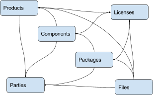
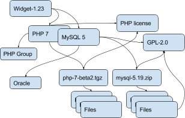

.. _aboutcode_data:

AboutCode Data : ABCD
=====================

Summary
-------

ABCD is an abbreviation for ABout Code Data. The AboutCode Data goal is
to provide a simple, standardized and extensible way to document data
about software code such that:

-  It is a common way to exchange data about code between any nexB tools
   by import and export.

-  It becomes the preferred way to exchange data between nexB tools and
   other tools.

-  It could become a valuable structure to exchange data between any
   tools concerned with data about software.

ABCD is technology and programming language neutral, preferring JSON or
YAML document formats.

ABC Data is structured around a few basic objects: Products, Components,
Packages, Files, Parties and Licenses. It is extensible to other
specific or future object types.

Objects have "attributes" that are simple name/value pairs. A value can
be either a plain value or another object or a list of objects and
attributes.

ABC Data is minimally specified by design: only a few basic objects and
attributes are documented with conventions to name and structure data
and how to define relationships between objects. There is only a small
reference dictionary for some well known attributes documented here.

The planned benefit for tools using ABC Data is simplified data exchange
and integration between multiple best-of-breed tools.

Context
-------

There is currently no easy way to describe information about code and
software in a simple and standardized way. There have been many efforts
to provide this data in a more structured way such as:

-  SPDX (focused on packages and licenses),
-  DOAP (focused on projects),
-  The original ABOUT metafile format, and
-  The many different software package metadata formats (Maven, NPM,
   RPM, Deb, etc).

These data structures are fragmented and generally too purpose- or
technology-specific.

Recently there have been efforts to collect and expose more data such
as:

-  libraries.io (a catalog of packages, AGPL-licensed)
   and dependencyci.com its companion commercial service,
-  versioneye.com (a catalog of package versions updates, now
   MIT-licensed),
-  softwarearchive.org (an effort to build an all-encompassing software
   source code archive),
-  sources.debian.net (a Debian-focused code and metadata search
   facility),
-  searchcode.com (an add-supported source code search engine exposing
   some metadata)
-  appstream (a cross-distro effort to normalize desktop package
   metadata access to Linux desktops
   https://www.freedesktop.org/software/appstream/docs/).

These efforts are all useful, but they do not address how you can
consistently exchange data about code in a user-centric and
technology-neutral, normalized way.

Why does this matter? Software and code are everywhere. FLOSS code is
exploding with millions of components and packages. The data about this
code is out there somewhere but getting it is often too difficult. This
is a problem of data normalization, aggregation and exchange.

Whether you consume or produce software, accessing and creating
normalized data about your code and the code you use should be made
easier such that:

-  You can efficiently make code selection and re-use decisions,

-  You can discover what is in your code, and

-  You can continuously track updates, bugs, licenses, liveliness,
   quality and security attributes of the code you use or consider
   using.

With the notable exceptions of SPDX and the earlier versions of the
ABOUT format, available data formats about software have been designed
first for a specific technology (e.g. Linux distros) or programming
language (e.g. maven, npm, etc.) and documentation of code provenance
and related attributes has been secondary and minimal. In most cases,
the primary focus has been to provide first comprehensive support for
package installation, dependency resolution or package building and
provenance and licensing information is often treated with lesser
details.

ABCD: the AboutCode Data structure
----------------------------------

ABCD is an abbreviation for ABout Code Data. The goal is to provide a
simple, standardized and extensible way to document things about
software code.

In contrast with other approaches, the AboutCode Data structure is
focused on providing data that is useful to users first and is not
limited to software package data only. AboutCode Data need not
be as strictly specified as traditional package manager data formats
because its purpose is not to drive a software build, package creation
or software installation nor is it to compute the resolution of
dependencies. It only provides information (metadata) about the code.

The vision for the ABC Data structure is to provide a common way to
exchange data about code between all nexB tools, such that these tools
can all import and export data about code seamlessly (TraceCode,
ScanCode, AboutCode Manager, AttributeCode, upcoming MineCode, etc.).
The ABCD structure should also be the preferred way to exchange data
about code between nexB tools and other tools. We may create small
adapters to convert other data formats in and out of the ABCD structure
and encourage other tool authors to natively support ABC Data, though
the main focus is on our tools.

The ABCD structure is technology and programming language neutral and
designed so that the parties exchanging data about code can do so
reliably with some minimal conventions; and that the data is easily
processed by machines and not hard to read by humans.

ABC Data is structured around "objects". Objects have "attributes" that
are simple name/value pairs. A value can be either a plain value or
another object or a list of nested objects and attributes.

ABC Data is organized around:

-  a few known object types,

-  simple conventions to create lists of objects and describe object
   relationships,

-  simple conventions to create attributes as name/value pairs, and

-  a small dictionary or vocabulary of well-known attribute names that
   have a common definition across all tools.

ABC Data is "under-specified" by design: only a few essential objects
and attributes are documented here with the conventions on how to
structure the ABC Data.

Basic objects describing data about code
----------------------------------------

At the top level we have these main object types:

-  Product(s): a software product, application or system such as a Cost
   Accounting application.

-  Component(s): a software component, such as the PostgreSQL 9 database
   system, usually a significant or major version

-  Package(s): a set of files that comprise a Component as used, such as
   a postgresql-9.4.5-linux-x86.zip archive. The version is exact and
   specific.

-  File(s): any file and directory identified by a path, such as a
   binary package or a source code directory or file.

And these secondary, important but less prominent object types:

-  Party(ies): a person or an organization. An organization can be a
   project, formally or informally organized, a company, a department
   within a company, etc. A Party typically has contact information
   (such as an email or physical address or home url). A Party may have
   defaults that apply to much of its software (for an org that creates
   software) such as a default Apache license for Apache Foundation
   projects. Parties often relate to other objects through a
   role relationship such as owner, author, maintainer, etc.

-  License(s): information about the license of code. A License
   typically has a name, text and additional categories. (tags or
   attributes).

Each of these objects has a few identifying attributes and eventually
many tool- or application-specific data attributes. Each tool defines
and documents the attributes they can handle and care for. When some
agreement is reached on the definition of new attributes or objects, the
ABCD dictionary may be updated accordingly with new objects types such
as for software security, quality or other interesting aspects.

Objects are interrelated with other objects. Objects can relate to each
other via a reference using identifiers pointing to other objects or via
an embedded list of objects. The nature of the relationship between two
objects can also be specified with additional attributes as needed.

Here are typical relationships between objects:

|image1|

Here is an example of relationships for a simple Widget product:

|image2|

Tools can define any custom objects and some used more commonly may be
promoted to be documented here over time.

Attribute Names and Values
--------------------------

By convention, a tool receiving ABC Data should process only the data it
knows and should ignore unknown attributes or objects. This is important
to allow the data structure to evolve and provide some forward and
backward compatibility. When an ABCD payload contains data elements that
a receiver does not know about, the receiver should still be able to
process the known objects and attributes.

-  Attributes are name/value pairs.

-  Attribute names are always strings, not numbers, not booleans, not any
   other data format. In these strings, leading and trailing white spaces
   (spaces, tabs, line returns, etc) are not significant and can be safely
   ignored or removed.

-  Attribute values are one of the standard JSON types: string, number,
   boolean or null. In strings, leading and trailing white spaces (spaces,
   tabs, line returns, etc) are not significant and can be safely ignored
   or removed.

-  Self-explicit names should be used rather than obscure names or
   abbreviations: names should be self-explicit and self-evident.

Except for the data organization conventions described here and the use
of the well-known object and attribute names, nothing is mandatory in
the ABCD format. This means that even partial, incomplete or sketchy
data about code can be transferred in this format.

The meaning of well known object names such as Product, Component,
Package, File, Party and License is defined in this document.

Name conventions
----------------

-  Names are strings composed ONLY of ASCII letters, numbers or
   underscores. Names cannot start with a number. Names cannot contain
   spaces nor other punctuation, not even a dot or period.

-  Names are NOT case sensitive: upper or lowercase does not matter and
   the standard is to use lowercase. It is a mistake to use upper or
   mixed case but this is something a parser receiving ABC Data should
   recover from nicely by converting the names to lowercase.

-  Names are made of English words: there is no provision currently for
   non-English names. Tools that deal with multilingual content may
   define their own conventions to provide content in other languages.
   ABCD may add one of these conventions in the future.

-  Parser implementation can be smarter and gentler: For names, anything
   that is not ASCII or number or underscore can be accepted by a parser
   and could be replaced by an underscore, including a starting digit if
   any. Or a parser may provide a warning if there is an unknown name
   that is very close to a well known name. Or a parser may accept
   CamelCase and transform names to underscore_case and perform another
   transformation to conventional ABC Data.

-  Names are singular or plural: When a name refers to more than one
   item, the name of the field is plural and the value is a list of
   values. For instance "url" and "urls".

-  Top level known objects are ALWAYS plural and stored in lists:
   "parties" or "files" or "products" or "components". This makes it
   easier to write tools because the top level types are always lists,
   even when there is a single object in that list.

-  A value must not be used as a name: in an attribute name/value pair,
   the name is always a name, not a value and every value must have a
   name.

-  For instance, this JSON snippet would not be correct where a URL is
   used as a name::

       {"http://someurl.com": "this is the home URL"}

-  Use rather this form to specify a name for the URL attribute::

       {"url": "http://someurl.com", "note": "this is the home URL"}

-  But this would be correct when using a list of plain values where
   "urls" is plural::

       {"urls": ["http://someurl.com", "http://someurl2.com"]}

-  An attribute names without a value is not needed. Only names with
   values are needed, and attributes without values can be omitted: each
   tool may do what it wants for these cases. For instance it may be handy
   to provide all attributes even if not defined in an API payload. But
   when serializing data as YAML, meant for human editing, including all
   empty values may not help with reading and processing the YAML text.
   An undefined attribute without a set value should be assigned with
   the null JSON value: this has the same meaning as if the attribute
   was not specified and absent from the payload. If you want to specify
   that an attribute has an empty value and does not have a value (as
   opposed to have an unknown value) use an empty string instead.

-  Avoid abbreviated names, with some exceptions. Names should always be
   fully spelled out except for:

    -  url: uniform resource locator
    -  uri: uniform resource identifier
    -  urn: uniform resource name
    -  vcs: version control system
    -  uuid: universally unique identifier, used for uuid4 string
       `https://tools.ietf.org/html/rfc4122.html <https://tools.ietf.org/html/rfc4122.html&sa=D&ust=1487355496775000&usg=AFQjCNFPvpqA_MFbGaOmykUF8a5GGUKRSw>`__
    -  id: identifier
    -  info: information
    -  os: operating system
    -  arch: architecture

-  For some common names we use the common compound form such as:

    -  codebase: and not code_base
    -  filename: and not file_name
    -  homepage: and not home_page

Well known attribute names include:

-  name: the name of a product, component, license or package.
-  version: the version of a product, component, package.
-  description: description text.
-  type: some type information about an object. For instance, a File
   type could be: directory, file or link.
-  keywords: a list of keywords about an object. For example, the
   keywords of a component used to "tag" a component.
-  path: the value is the path to a file or directory, either absolute
   or relative and using the POSIX convention (a forward slash as
   separator). For Windows paths, replace backslash with forward
   slashes. Directories should end with a slash in a canonical form.
-  key: the value is some key string, slug-like, case-insensitive and
   composed only of ASCII letters and digits, dash, dot and underscore.
   No white spaces. For example: org.apache.maven-parent
-  role: the value describes the role of a Party in a relationship with
   other objects. For instance a Party may be the
   "owner" or "author" of a Component or Package.
-  uuid: a uuid4 string
   `https://tools.ietf.org/html/rfc4122.html <https://tools.ietf.org/html/rfc4122.html>`_
-  algorithms for checksums: to store checksums we use a name/value
   pairs where the name is an algorithm such as sha1 and the value is a
   checksum in hexadecimal such as "sha1": "asasa231212" . The value is
   the standard/default string created by command line tools such as
   sha1sum. Supported algorithms may evolve over time. Common checksums
   include md5, sha1, sha256, sha512.
-  notes: some text notes. This is an exception to the singular/plural
   rule for names: notes is a single text field and not a list.

As the usage of the ABCD structure matures, more well known names will
be documented in a vocabulary.

Value conventions
-----------------

-  Attribute values are one of the standard JSON types: string, number,
   boolean or null. In strings, leading and trailing white spaces
   (spaces, tabs, line returns, etc) are not significant and can be
   safely ignored or removed.

-  To represent a date/time use the ISO format such as 2016-08-15
   defaulting to UTC time zone if the time zone is not specified in the
   date/time stamp.

-  All string values are UTF-8 encoded.

Well known name prefixes or suffixes can be used to provide a type hint
for the value type or meaning:

-  xxx_count, xxx_number, xxx_level: the value is an integer number.
   Example: results_count or curation_level

-  date_xxx or xxx_date: the value is a date/time stamp in ISO format
   such as 2016-08-16 (See https://www.ietf.org/rfc/rfc3339.txt ).
   Examples: last_modified_date, date_created

-  xxx_url: the value is a URL for web http(s) or ftp url that points
   to an existing valid web resource (that could possibly no longer
   exist on the web). Example: homepage_url or api_url

-  xxx_uri: the value is a URI typically used as an identifier that may
   not point to an existing web resource. Example:
   git://github.com/nexb/scancode-toolkit

-  xxx_file or xxx_path: the value is a file path. This can come handy
   for external files such as a license file. Example: notice_file

-  xxx_filename: the value is a file name. Example: notice_filename

-  xxx_text: the value is a long text. This is only a hint that it may
   be large and may span multiple lines. Example: notice_text

-  xxx_line: such as start_line and end_line: the value is a line
   number. The first line number is 1.

-  xxx_status: such as configuration_status. Indicates that the value
   is about some status.

-  xxx_name: such as short_name. Indicates that the value is a name.
   Commonly used for long_name, short_name. The bare name shout be
   preferred for the obvious and most common way an object is named.

-  xxx_flag, is_xxx, has_xxx: such as is_license_notice. Indicates
   that the string value is a boolean.

Object identifiers
------------------

We like objects to be identifiable. There is a natural way to identify
and name most objects: for instance, the full name of a person or
organization or the name and version of a Component or Package or the
path to a File, are all natural identifiers to an object.

However, natural names are not always enough to fully identify an object
and may need extra context to reference an object unambiguously. There
could be several persons or organizations with the same name at a
different address. Or the foo-1.4 Package could be available as a
public RubyGem and also as an NPM; or a private Python package foo-1.4
has been created by a company and is also available on Pypi. Or the
"foo" Package is the name of a Linux Package, an NPM and a Ruby Package
but these three packages are for unrelated components.

Hence each object may need several attributes to be fully identifiable.

For example, public package managers ensure that a name is unique within
the confines of a source. "logging" is the unique name of a single
Sourceforge project at
`https://sourceforge.net/projects/logging/ <https://sourceforge.net/projects/logging/>`_.
"logging" is the unique name of an Apache project at the Apache
Foundation `http://logging.apache.org/ <http://logging.apache.org/>`_.

Yet, these two names point to completely different software. In most
cases, providing information about the "source" where an identifier is
guaranteed to be unique is enough to ensure proper identification. This
"source" is easily identified by its internet source name, and an
internet source name is guaranteed to be unique globally. The "source"
of identifiers is not mandatory but it is strongly encouraged to use as
an attribute to provide good unique identifiers. Still, tools exchanging
ABC Data must be able to exchange under-specified and partially
identified data and may sometimes rely on comparing many attributes of
two objects to decide if they are the same.

The minimal way to identify top level objects is the combination of a
"source" and a unique identifier within this source. The source can be
implicit when two parties are exchanging data privately or explicit
using the "source" attribute.

Within a source, we use the most obvious and natural identifies for an
object. For example:

-  For Products, Components and Packages we can use their name and
   version.

-  For Files we use a path of a file or directory, possibly relative to
   a package or a product codebase; or a checksum of a file or archive
   such as a sha1.

-  For Parties, we use a name possibly supplemented with a URL or email.

-  For all object types we can use a "universally unique id" or UUID-4
   (https://tools.ietf.org/html/rfc4122.html)

-  For all object types, we can use a key, which is a slug-like string
   identifier such as a license key.

-  For all object types, we can use a URN
   (https://en.wikipedia.org/wiki/Uniform_resource_name) Tools may
   also define their own URNs, namespaces and names such as a DejaCode
   urn is, urn:dje:component:16fusb:1.0

Beyond direct identification, an object may have several alternative
identifiers, aka "external references". For instance a Package may have
different names and slightly different versions in the Linux, Debian or
Fedora distros and a Pypi Package with yet another name where all these
Packages are for the same Component and the same code. Or a Party such
as the Eclipse Foundation may be named differently in DejaCode and the
NVD CPEs.

To support these cases, the "external_reference(s)" attribute can be
used where needed in any object to reference one or more external
identifiers and what is the source for this identifier (note: "external"
is really a matter of point of view of who owns or produces the ABC
Data).  An attribute with name suffix of "xxx_reference" may also be
used to provide a simpler external reference, such as "approval_reference".

For example, this ABC Data could describe the external id of Party to a
CPE and to TechnoPedia (here in a YAML format)::

    parties:
      - name: Apache Foundation
        homepage_url: http://apache.org
        type: organization
        external_references:
            - source: nvd.nist.gov
              identifier: apache
            - source: technopedia.com
              identifier: Apache Foundation (The)
            - source: googlecode.com
              identifier: apache-foundation

Other identifiers may also be used, as needed by some tools, such as
in hyperlinked APIs.

Organizing data and relationships
---------------------------------

Describing relationships between objects is essential in AboutCode Data.
There are two ways to describe these relationships: by referencing or by
embedding objects.

When using a reference, you relate objects by providing identifiers to
these objects and may provide additional object details in separate
lists. When embedding, you include not only the reference but also the
related object details in another object data. This could include all
data about an object or a subset as needed.

For example, this components list embeds a list of two packages.

Note: "components" is always a list, *even when it has a single component*::

    {"components": [{
        "source": "http://apache.org",
        "name": "Apache httpd",
        "version": "2.3",
        "packages": [
            {"name": "httpd",
             "version": "2.3.4",
             "download_url": "http://apache.org/dist/httpd/httpd-2.3.4.zip",
             "sha1": "acbf23256361abcdf",
             "size": 3267,
             "filename": "httpd-2.3.4.zip"
            },

            {"name": "httpd",
             "version": "2.3.5",
             "download_url": "http://apache.org/dist/httpd/httpd-2.3.5.tar.gz",
             "sha1": "ac8823256361adfcdf",
             "size": 33267,
             "filename": "httpd-2.3.5.tar.gz"
            }
        ]
    }]}

In this example, the component list references two packages that are
listed separately and uses the checksum as package identifiers for the
reference. This data is strictly equivalent to the previous example but
using a different layout. When all the data is provided, the effect of
embedding or referencing objects results in the same data, just
organized differently::

    {"components": [{
        "source": "http://apache.org",
        "name": "Apache httpd",
        "version": "2.3",
        "packages": [
            {"sha1": "aacbf23256361abcdf"},
            {"sha1": "ac8823256361adfcdf"}
        ]
    }],

    "packages": [
        {"name": "httpd", "version": "2.3.4",
         "download_url":
         "http://apache.org/dist/httpd/httpd-2.3.4.zip",
         "sha1": "acbf23256361abcdf", "size": 23267, "filename": "httpd-2.3.4.zip"},

        {"name": "httpd", "version": "2.3.5",
         "download_url": "http://apache.org/dist/httpd/httpd-2.3.5.tar.gz",
         "sha1": "ac8823256361adfcdf", "size": 33267, "filename": "httpd-2.3.5.tar.gz"}
    ]}

In this third example the packages are referencing one component
instead. That component is always wrapped in a components list. The
component detail data is not provided. The details may be available
elsewhere in a tool that tracks components::

    "packages": [
        {"name": "httpd", "version": "2.3.4",
         "download_url": "http://apache.org/dist/httpd/httpd-2.3.4.zip",
         "sha1": "acbf23256361abcdf", "size": 23267, "filename": "httpd-2.3.4.zip",
         "components": [
            {"source": "http://apache.org", "name": "Apache httpd", "version": "2.3"}
         ]
        },

        {"name": "httpd", "version": "2.3.5",
         "download_url":"http://apache.org/dist/httpd/httpd-2.3.5.tar.gz",
         "sha1": "ac8823256361adfcdf", "size": 33267, "filename": "httpd-2.3.5.tar.gz",
         "components": [
            {"source": "http://apache.org", "name": "Apache httpd", "version": "2.3"}
         ]
        }
    ]

Relationships can be documented with this approach in different ways.
Typically when the primary concern is about a Product, then the Product
object may embed data about its Components. When the primary concern is
Packages, they may embed or reference Products or Components or files.
For example:

-  A tool may prefer to provide data with products or components as top level
   objects. The components used in a Product are naturally embedded in the products.

-  A tool concerned more with files, will provide files as top
   level objects and may embed package details when they are found for
   a file or directory path.

-  Another tool may focus on packages and provide packages first with
   component references and possibly embedded files. A matching tool
   may provide packages first and reference matched files. The file
   paths of a package are naturally embedded in the package, though
   using references may help keep the data simpler when there is a large
   volume of files.

-  A tool that generates attribution documentation may focus
   first on components and second on licenses or packages references.

-  A tool dealing with security vulnerabilities may define a
   Vulnerability object and reference Packages and Files that are
   affected by a Vulnerability.

To better understand the embedding or referencing relationships:

-  using references is similar to a tabular data layout, akin to a
   relational database table structure

-  using embedding is similar to a tree data layout such as in a
   file/directory tree or nested data such as XML.

Another way to think about these relationships is a "GROUP BY" statement
in SQL. The data can be grouped-by Component, then Packages or
grouped-by Files then Components.

Both referencing and embedding layouts can be combined freely and are
not mutually exclusive. When using both at the same time, some care is
needed to avoid creating documents with conflicting or duplicated data
that is referenced and embedded at the same time.

Using references is often useful when there is an agreement on how to
reference objects between two tools or parties. For instance, when using
nexB tools, a unique and well defined license key is used to reference a
license rather than embedding the full license details. A concise
reference to the name and version of a public package from a well known
package repository such as RPM or Maven can be used to the same effect.
Or an SPDX license identifier can be used to reference an SPDX-listed
license without having to embed its full license text.

The nature of the relationship between two objects can be specified when
it is not obvious and requires some extra specification.  Each tool can
define additional attributes to document these. For instance a common
relationship between a party and a product or component is a role such
as owner. For packages a role can be maintainer, author, etc.  Or the
license of a file or package may be the "asserted" license by the
project authors. It may differ from the "detected" license from a scan
or code inspection and may further differ from a "concluded" license or
a "selected" license when there is a license choice. At the package and
license level the types of relationships documented in the SPDX
specification are a good source for more details. For example this
component references two parties where one is the author and the other
is the maintainer documented using a role attribute::

    "components": [{
        "source": "http://apache.org",
        "name": "Apache httpd",
        "version": "2.3",
        "parties": [
            {"name": "John Doe", "type": "person", "role": "author"},
            {"name": "Jane Smith", "type": "person", "role": "maintainer"},
            {"name": "Jane Smith", "type": "person", "role": "owner"},
        ]
    }]

Document format conventions
---------------------------

The default ABC Data format is JSON (though it can be serialized to
anything else that would preserve its structure). YAML is also supported
and preferred for storage of simple documents that document one or a few
top level objects and that need to be edited by a human.

The data structure by nested name/value pairs attributes and lists of
values maps naturally to the corresponding JSON and YAML constructs. In
JSON-speak these are arrays (lists) and objects (name/value pairs).

ABC Data can be provided as simple files or embedded in some API
payload. As files, their content can be either JSON or YAML and should
have either a .json or .yml extension by convention. For backwards
compatibility with previous AboutCode conventions, the .ABOUT extension
can be used for YAML documents. For instance this is used in the legacy
about_code_tool and its successors. The DocumentCode tool can store
individual attribution data in a .ABOUT yml file.

The top level structure of an ABC Data block is always a JSON object or
YAML dictionary. Depending on the context this top level structure may
be wrapped in another data structure (for instance when exchanging
AboutCode Data in some web api, the API may provide ABC Data as a
payload in a "results" or "body" or "data" block and also have some
"headers" or "meta" block).

The top level elements must contain at least one of the object names and
a list of objects such as here with a list of files::

    files:
        - path: this/foo/bar
          size: 123
          sha1: aaf35463472abcd
        - path: that/baz

Optionally an "aboutcode_version" attribute can be added at the top
level to document which version of the AboutCode Data structure is used
for a document. For example: aboutcode_version: 4.0

Order of attributes matters to help reading documents: tools that write
ABC Data should attempt to  use a consistent order for objects and
attribute names rather than a random ordering. However, some tools may
not be able to set a specific order so thi is only a recommendation. The
preferred order is to start with identifiers and keys and from the most
important to the least important attributes, followed by attributes
grouped logically together,  followed by related objects.

References between documents and payload, embedding other files
---------------------------------------------------------------

ABC Data may reference other data. For instance in a hyperlinked REST
API a list of URLs to further invoke the API and get license' details
may be provided with an api_url attribute to identify which API calls
to invoke. The ways to reference data and the semantics and mechanics of
each of these embeddings or references needed to get the actual data are
not specified here. Each tool may offer its own mechanism. A convention
for an hyperlinked REST API JSON payload could be to use
api_url(s) identifier to specify additional "GET"able endpoints. The
AttributeCode tool use \*_file attributes in YAML or JSON documents
to reference external license and notices text files to load with the
text content.

Another convention is used in ScanCode to reference license texts and
license detection rules by key:
An ABC Data YAML file contains the ABC Data. And side by side there is a
file with the same base name and a LICENSE, SPDX or NOTICE, RULE,
extension that contains the actual text corresponding to the license,
the SPDX text or the rule text. The convention here is to use an
implicit reference between files because they have the same base name
and different extensions.

In the future, we may specify how to embed an external ABC Data file in
another ABC Data file; this would only apply to file-based ABC Data
payload though and could not apply to hyperlinked REST APIs.

Document-as-files naming, exchange and storage
----------------------------------------------

Each tool handling ABC Data may name an ABC Data file in any manner and
store the data in any way that is appropriate. The structure is a set of
data exchange conventions and may be used for storage but nothing is
specified on how to do this.

For consistency, tools consuming AboutCode Data are encouraged to use
the same data structure internally and in their user interface to
organize and name the data, but this is only a recommendation.

For instance, the AttributeCode tool uses a convention to store ABC Data
as YAML in a file with a .ABOUT extension and uses the ABC Data structures
internally and externally.

When exchanging data (for instance over an API), the API provider of ABC
Data should support a request to return either embedded data or data by
reference and ideally allow the caller to specify which objects and
attributes it is interested in (possibly in the future using something
like GraphQL).

When interacting with tools through an  API, the conversation could
start by sending an ABC Data payload with some extra request data and
receiving an ABC Data payload in return. For instance, when requesting
matching packages from a matching tool, you could start by passing scan
data with checksums for several files at once and receive detailed data
for each of the matched files or packages.

Documenting and validating attributes
-------------------------------------

Each tool handling ABC Data may only be interested in processing certain
objects and attributes when accepting data in, or when providing data
out. Attributes that are unknown should be ignored. To document which
objects and which attributes a tool can handle, a tool should provide
some documentation. The documentation format is not specified here, but
it could use a JSON schema in the future. This should include
documentation regarding if and how data is validated, and when and how
errors or warnings are triggered and provided when there is a validation
error. For example, a validation could be to check that an SPDX license
id exists at SPDX or that a URL is valid.

Notes on YAML format
--------------------

YAML is the preferred file format for ABC Data destined for reading or
writing primarily by humans.

-  Block-style is better.

-  When you write AboutCode Data as YAML, you should privilege block-style
   and avoid flow-style YAML which is less readable for humans.

-  Avoid Multi-document YAML.

-  Multi-document YAML documents should be avoided (when using the ---
   separators).

-  Beware of parser shenanigans:  Most YAML parsers recognize and convert
   automatically certain data types such as numbers, booleans or dates.
   You should be aware of this because the ABC Data strings may contain
   date stamps. You may want to configure a YAML parser to deactivate some
   of these automated format conversions to avoid unwanted conversions.

Notes on JSON Format
--------------------

JSON is the preferred file format for ABC Data destined for reading and
writing primarily by machines.

- "Streamable"  JSON with JSON-lines.

A large JSON document may benefit from being readable line-by-line
rather than loaded all at once in memory. For this purpose, the
convention is to use JSON lines where each line in the document is a
valid JSON document itself: this enables reading the document in
line-by-line increments. The preferred way to do so is to provide one
ABCD top level object per document where the first line contains meta
information about the stream such as a notice, a tool version or  the
aboutcode version.

- Avoid escaped slash.

The JSON specification says you CAN escape forward slash, but this is
optional. It is best to avoid escaping slash when not needed for better
readability.

For instance for URLs this form::

    "https://enterprise.dejacode.com/component_catalog/nexB/16fusb/1.0/"

should be preferred over this escaped form when backslashes are not
needed::

    "https:\\/\\/enterprise.dejacode.com\\/component_catalog\\/nexB\\/16fusb\\/1.0\\/"

Notes on embedding ABC Data in source code files.
-------------------------------------------------

It could be useful to include ABC Data directly in a source code file,
such as to provide structured license and provenance data for a single
file. This requires of course a file modification. While this is not a
preferred use case, it can be handy to document your own code one file
at a time. Using an external ABC Data file should be preferred but here
are conventions for this use case:

-  The ABC Data should be embedded in a top level block of comments.
-  Inside that block of comments the preferred format is YAML.
-  How a tool collects that ABC Data when embedded in code is to be
   determined.
-  Tools offering such support should document and eventually enforce
   their own conventions.

Notes on spreadsheet and CSV files
----------------------------------

ABC Data does not support or endorse using CSV or spreadsheets for data
exchange.

CSV and other spreadsheet file formats are NOT recommended to store ABC
Data. In most cases you cannot store a correct data set in a spreadsheet.
However, these tools are also widely used and convenient.
Here are some recommendations when you need  to communicate ABC data in
a CSV or spreadsheet format: even though ABC Data is naturally nested
and tree-like, it should be possible to serialize certain ABCD objects
as flat, tabular data.

-  Naming columns

The table column names may need to be adjusted to correctly reference
the multiple level of object and attribute nesting using a dot as a
separator. The dot or period is otherwise not allowed in attribute
names. For example, you could use files.path for files or
components.name to reference a component name. Some tools may prefer to
create tabular files with their own column names and layout, and provide
mappings to ABC Data attribute and object names.

-  Example for an inventory:

Since ABC Data can be related by reference, the preferred (and
cumbersome) way to store ABC Data in a spreadsheet is to use one tab for
each object type and use identifying attributes to relate objects
between each others across tabs. For instance, in a Bill of Materials
(BOM) spreadsheet for a Product, you could use a tab to describe the
Product attributes and another tab to describe the Components used in
this Product and possibly additional tabs to describe the related
packages and files corresponding to these

-  Care is needed for Packages, Components and other names and for dates,
   versions, unicode and UTF-8 to avoid damaging content (aka. mojibake)

Spreadsheet tools such as Excel or LibreOffice  automatically recognize
and convert data to their own format: a date of 20016-08-17 may be
converted to a date number when a CSV is loaded and difficult to recover
as a correct original date stamp string afterwards. Or a version 1.0 may
be irreversibly converted to 1 or 1.90 to 1.9 losing important version
information.

Spreadsheet tools may not recognize and handle properly UTF-8 texts and
damage descriptions and texts. These tools may also treat strings
starting with the equal sign as a formula. When incorrectly recognizing
special accentuated characters this may damage texts creating what is
called "mojibake" (See https://en.wikipedia.org/wiki/Mojibake)

Always use these tools with caution and be prepared for damage to your
data if you use these tools to save or create ABC Data.

Impact on AttributeCode
~~~~~~~~~~~~~~~~~~~~~~~

As an integration tool, AttributeCode itself may specify only a very few elements.

The new structure will need to be implemented. Here could be an example
in YAML::

    aboutcode_version: 4.0
    components:
     -  source: dejacode.com
        name: bitarray
        version: 0.8.1
        homepage_url: https://github.com/ilanschnell/bitarray
        copyright: Copyright (c) Ilan Schnell and others
        files:
            - path: some/directory/
               type: dir
            - path: bitarray-0.8.1-cp27-cp27m-macosx_10_9_intel.whl
            - path: someotherdir/bitarray-0.8.1-cp27-cp27m-manylinux1_i686.whl
            - path: bitarray-0.8.1-cp27-cp27m-manylinux1_x86_64.whl
            - path: bitarray-0.8.1-cp27-cp27m-win_amd64.whl
            - path: bitarray-0.8.1-cp27-cp27m-win32.whl
            - path: bitarray-0.8.1-cp27-cp27mu-manylinux1_i686.whl
            - path: bitarray-0.8.1-cp27-cp27mu-manylinux1_x86_64.whl
            - path: bitarray-0.8.1-cp27-none-macosx_10_6_intel.whl
            - path: bitarray-0.8.1.tar.gz

        parties:
          - role: owner
            name: Ilan Schnell

        packages:
          - download_url: http://pypi.python.org/packages/source/b/bitarray/bitarray-0.8.1.tar.gz
            sha1: 468456384529abcdef342

        license_expression: psf

        licenses:
          - source: scancode.com
            key: psf
            text_file: PSF.LICENSE

And here would be similar data in JSON::

    {"components": [{
                   "name": "bitarray",
                   "version": "0.8.1"
                   "homepage_url": "https://github.com/ilanschnell/bitarray",
                   "copyright": "Copyright (c) Ilan Schnell and others",
                   "license_expression": "psf",
                   "licenses": [{"key": "psf", "text_file": "PSF.LICENSE", "source": "scancode.com"}],
                   "packages": [{"download_url": "http://pypi.python.org/packages/source/b/bitarray/bitarray-0.8.1.tar.gz"
                                "sha1": "468456384529abcdef342"
                    }],
                   "parties": [{"name": "Ilan Schnell", "role": "owner"}],

                   "files": [{"path": "some/directory/", "type": "dir"},
                             {"path": "bitarray-0.8.1-cp27-cp27m-macosx_10_9_intel.whl"},
                             {"path": "bitarray-0.8.1-cp27-cp27m-manylinux1_i686.whl"},
                             {"path": "bitarray-0.8.1-cp27-cp27m-manylinux1_x86_64.whl"},
                             {"path": "bitarray-0.8.1-cp27-cp27m-win_amd64.whl"},
                             {"path": "bitarray-0.8.1-cp27-cp27m-win32.whl"},
                             {"path": "bitarray-0.8.1-cp27-cp27mu-manylinux1_i686.whl"},
                             {"path": "bitarray-0.8.1-cp27-cp27mu-manylinux1_x86_64.whl"},
                             {"path": "bitarray-0.8.1-cp27-none-macosx_10_6_intel.whl"},
                             {"path": "bitarray-0.8.1.tar.gz"}],
                   }],

     aboutcode_version: "4.0"}

Impact on ScanCode Toolkit
~~~~~~~~~~~~~~~~~~~~~~~~~~

The new format will need to be implemented for scan results in general
and for packages in particular.

ScanCode will specify Package and several attributes related to scanning
and referencing clues for files, directories and packages.

Alternatively Packages could be extracted to an independent PackagedCode library.

The changes will minimize impact on the layout of the scan results. Here is an
example of a scan payload in ABCD format: this is essentially the standard scan
format::

    {
      "scancode_notice": "Generated with ScanCode and provided .......",
      "scancode_version": "2.0.0.dev0",
      "files_count": 7,
      "files": [
        {
          "path": "samples/JGroups/src/",
          "type": "directory",
          "files_count": 29
          "licenses" : [
              { "key":"apache-2.0",
                "concluded": true}
          ]
        }
        {
          "path": "samples/JGroups/src/GuardedBy.java",
          "date": "2015-12-10",
          "programming_language": "Java",
          "sha1": "981d67087e65e9a44957c026d4b10817cf77d966",
          "name": "GuardedBy.java",
          "extension": ".java",
          "file_type": "ASCII text",
          "is_text": true,
          "is_source": true,
          "md5": "c5064400f759d3e81771005051d17dc1",
          "type": "file",
          "is_archive": null,
          "mime_type": "text/plain",
          "size": 813,
          "copyrights": [
            {
              "end_line": 12,
              "start_line": 9,
              "holder": "Brian Goetz and Tim Peierls",
              "statement": "Copyright (c) 2005 Brian Goetz and Tim Peierls"
            }
          ],
          "licenses": [
            { "detected": true,
              "key": "cc-by-2.5",
              "short_name": "CC-BY-2.5",
              "homepage_url": "http://creativecommons.org/licenses/by/2.5/",
              "dejacode_url": "https://enterprise.dejacode.com/license_library/Demo/cc-by-2.5/",
              "text_url": "http://creativecommons.org/licenses/by/2.5/legalcode",
              "owner": {
                "name": "Creative Commons",
              },
              "detection_score": 100.0,
              "start_line": 11,
              "end_line": 11,
              "category": "Attribution",
              "external_reference": {
                "source": "spdx.org",
                "key": "CC-BY-2.5"
                "url": "http://spdx.org/licenses/CC-BY-2.5",
              },
            }
          ],
        },
        {
          "path": "samples/JGroups/src/ImmutableReference.java",
          "date": "2015-12-10",
          "md5": "48ca3c72fb9a65c771a321222f118b88",
          "type": "file",
          "mime_type": "text/plain",
          "size": "1838",
          "programming_language": "Java",
          "sha1": "30f56b876d5576d9869e2c5c509b08db57110592",
          "name": "ImmutableReference.java",
          "extension": ".java",
          "file_type": "ASCII text",
          "is_text": true,
          "license_expression": "lgpl-2.1-plus and lgpl-2.0-plus",
          "is_source": true,
          "copyrights": [{
            "end_line": 5,
            "start_line": 2,
            "holder": "Red Hat, Inc.",
            "statement": "Copyright 2010, Red Hat, Inc."
          }],
          "licenses": [
            { "detected": true,
              "key": "lgpl-2.1-plus",
              "category": "Copyleft Limited",
              "homepage_url": "http://www.gnu.org/licenses/old-licenses/lgpl-2.1-standalone.html",
              "start_line": 7,
              "end_line": 10,
              "short_name": "LGPL 2.1 or later",
              "owner": "Free Software Foundation (FSF)",
              "dejacode_url": "https://enterprise.dejacode.com/license_library/Demo/lgpl-2.1-plus/",
              "detection_score": 100.0,
              "external_reference": {
                "url": "http://spdx.org/licenses/LGPL-2.1+",
                "source": "spdx.org",
                "key": "LGPL-2.1+"
              }
            },
            { "concluded": true,
              "key": "lgpl-2.0-plus",
              "short_name": "LGPL 2.0 or later",
              "homepage_url": "http://www.gnu.org/licenses/old-licenses/lgpl-2.0.html",
              "end_line": 20,
              "dejacode_url": "https://enterprise.dejacode.com/license_library/Demo/lgpl-2.0-plus/",
              "text_url": "http://www.gnu.org/licenses/old-licenses/lgpl-2.0-standalone.html",
              "owner": "Free Software Foundation (FSF)",
              "start_line": 12,
              "detection_score": 47.46,
              "category": "Copyleft Limited",
              "external_reference": {
                "url": "http://spdx.org/licenses/LGPL-2.0+",
                "source": "spdx.org",
                "key": "LGPL-2.0+"
              }
            }
          ],
        },
        {
          "path": "samples/arch/zlib.tar.gz",
          "file_type": "gzip compressed data, last modified: Wed Jul 15 11:08:19 2015, from Unix",
          "date": "2015-12-10",
          "is_binary": true,
          "md5": "20b2370751abfc08bb3556c1d8114b5a",
          "sha1": "576f0ccfe534d7f5ff5d6400078d3c6586de3abd",
          "name": "zlib.tar.gz",
          "extension": ".gz",
          "size": 28103,
          "type": "file",
          "is_archive": true,
          "mime_type": "application/x-gzip",
          "packages": [
            {
              "type": "plain tarball"
            }
          ],
        }
      ]
    }

AboutCode Manager
~~~~~~~~~~~~~~~~~

As a primary GUI for data review and integration, AboutCode Manager
will need to be fluent in ABC Data to read/write ABC Data locally and
remotely through API from several sources.

The short term changes would include:

-  Support reading ABC Data from ScanCode
-  Writing ABC Data, adding conclusions as related objects in the proper
   lists

New and Future tools
~~~~~~~~~~~~~~~~~~~~

-  TraceCode: would likely specify low level attributes for files (such
   as debug symbols, etc) and how files are related from devel to deploy
   and back.
-  VulnerableCode: would likely specify a new Vulnerability object and
   the related attributes and may track several identifiers to the NIST
   NVD CPE and CVE.
-  DeltaCode: would likely specify attributes to describe the changes
   between codebases, files, packages.

Copyright (c) 2016 nexB Inc.

