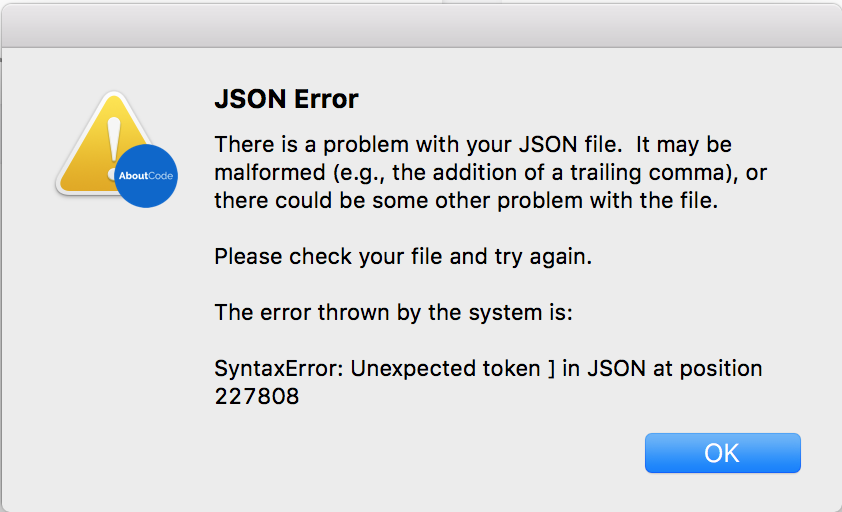
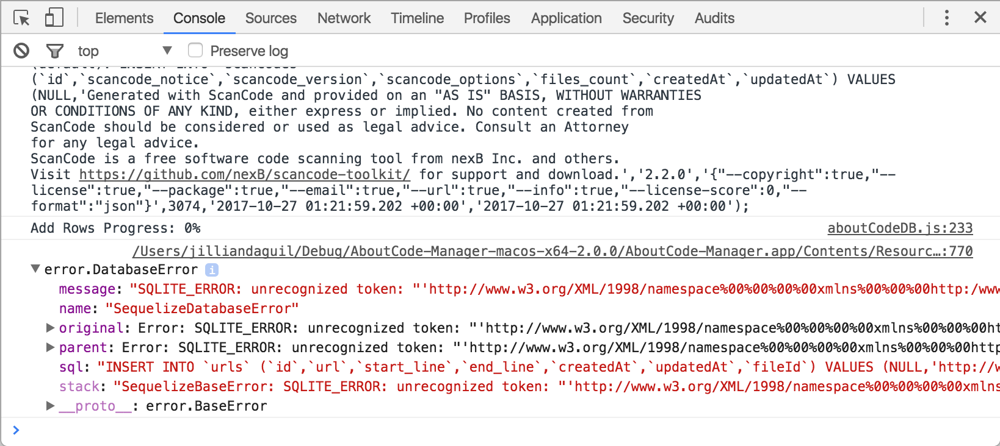

Check for Errors in the Developer Tools
=======================================

When an unexpected error occurs in ScanCode Workbench, you will normally see a dialog message which
provides details about the error and allows you to create an issue.

If you can reproduce the error, use this approach to get the stack trace and report the issue. Open
the Developer Tools with ``Ctrl+Shift+I`` or ``Alt+Cmd+I``. From there, click the Console tab.
Include the error that is logged in the issue in a code block or a file attachment.

