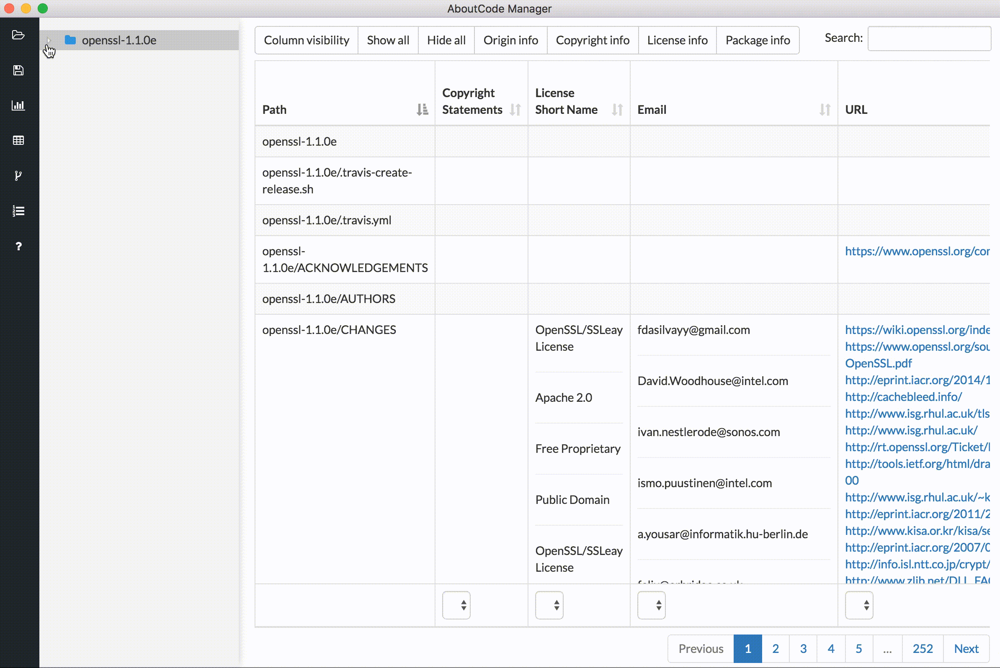
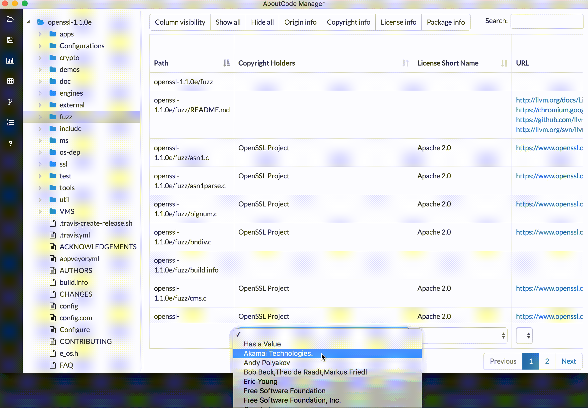

.. _workbench_views:

Scancode Workbench Views
========================

Directory Tree
--------------

An interactive directory tree is always present on the left side of the application. The tree is
expandable and collapsible. This allows the user to navigate the codebase structure. If a directory
is selected, only that directory and its sub-files and folders will be shown in the view.
Similarly, if a single file is selected, only information for that selected file will be shown.

Table View
----------

In the table view, the available clues detected by `ScanCode <https://github.com/nexB/scancode-toolkit/>`_
are shown in a tabular format. A user can see provenance clues such as license and copyright
information detected by ScanCode. A user can also see the file information (e.g. file type,
file size, etc) and package information (package type, primary language of package) that was
detected. The columns can be sorted as well as shown or hidden based on what the user’s
preferences. Searching for specific clues (license names, copyrights, etc.) is also available in
this view.

Chart Summary View
------------------

With the chart summary view, a user can select a node in the directory tree (i.e., a directory,
folder or file) and display a horizontal bar chart listing the values identified in the scanned
codebase -- that is, the clues detected by ScanCode Toolkit -- for a number of different
attributes. The attributes are a subset of the columns displayed in the table view, and can be
selected by clicking the dropdown at the top of the view. The chart displays the full range of
values for the selected directory tree node and attribute and the number of times each value occurs
in the scanned codebase.

.. image:: data/scancode-workbench-chart-summary.gif
