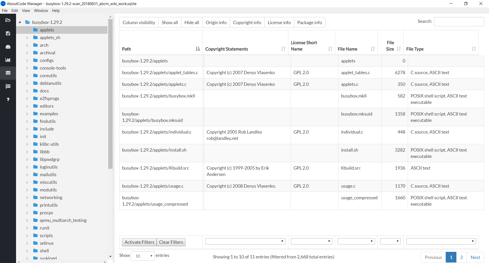
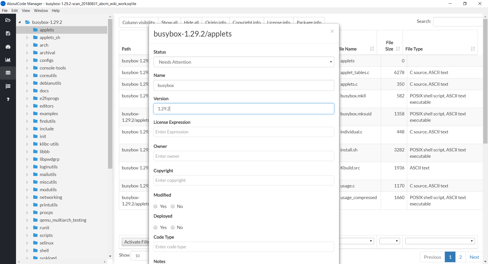

.. _workbench_components:

Creating Conclusions
====================

A Conclusion in ScanCode Workbench refers to the documentation of your analysis and conclusions
about the name, version, owner, copyright, license expression and other attributes for a single
software package or file or -- if you conclude these attributes are shared by a group of packages
and/or files -- for that group of packages/files.

You can record your Conclusions throughout the codebase you're analyzing, at any level of the
codebase (i.e., nodes in the directory tree representing the codebase) you think will best reflect
the results of your analysis.

To create a Conclusion, begin by navigating to the ``ScanDataTable`` view.

In the directory tree on the left, choose the directory, package or file you want to annotate,
right-click that node, and select ``Edit Conclusion`` in the menu that appears. This will display a
form with the path to that node displayed at the top of the form, and a series of attribute names
(e.g., ``Status``\ , ``Name``\ , ``Version``\ , ``License Expression``\ , ``Owner``\ ,
``Copyright``\ ) and associated textboxes, dropdowns or radio buttons to record your input.

Conclusion Definitions
----------------------

The following fields are available when creating a Conclusion:

.. list-table::
   :header-rows: 1
   :widths: auto

   * - Conclusion Field
     - Description
   * - Status
     - Used to document status of Conclusion creation. The dropdown choices: **Analyzed** - A
       Conclusion has been created, **Needs Attention** - A Conclusion is flagged for further
       review, **Original Code** - A Conclusion references code from your organization,
       **Not Reporting** - A Conclusion that will not be reported and can be ignored.
   * - Name
     - The primary name for your Conclusion (usually a file, directory or library name). A
       Conclusion can represent any software-related object. Any Conclusion can contain one or
       more sub-Conclusions. The combined Conclusion Name and Version must be unique.
   * - Version
     - The Conclusion version number.
   * - License Expression
     - This is the overall license (an individual license or combination of several licenses) for
       the Conclusion. The Conclusion form will populate a dropdown with any License Expression
       data detected by ScanCode when the imported scan was run, using the ScanCode License
       Expression syntax (e.g., ``gpl-2.0`` represents the GPL 2.0 license).  The user can also
       manually add one or more License Expressions by typing in the textbox and then hitting the
       ``Enter`` key. The License Expression is intended to capture the facts of a license
       (primarily the text, as provided by its owner), as well as an organization's interpretation
       and policy regarding that license.
   * - Owner
     - An Owner identifies the original creator (copyright holder) of the code covered by the
       Conclusion. If this Conclusion code is in its original, unmodified state, the Conclusion
       owner is associated with the original author/publisher. If this Conclusion code has been
       copied and modified, the Conclusion owner should be the owner that has copied and modified
       it.
   * - Copyright
     - The Copyright notice that applies to the Conclusion code under the License Expression.
   * - Modified
     - A Yes/No choice indicating whether the Conclusion code has been modified.
   * - Deployed
     - A Yes/No choice indicating whether the Conclusion code has been deployed.
   * - Code Type
     - The default choices are **Source**\ , **Binary**\ , **Mixed** and **Document**.
   * - Notes
     - Any notes or comments the user wants to record.
   * - Feature
     - The name of a product feature or codebase module that applies to the code covered by the
       Conclusion.
   * - Purpose
     - The type of code covered by the Conclusion, e.g., Core, Test, Build, Documentation.
   * - Programming Language
     - The primary language of the Conclusion code.
   * - Homepage URL
     - The homepage URL for the Conclusion code.
   * - Download URL
     - The download URL for the original Conclusion code.
   * - License URL
     - The URL for the primary license represented by the License Expression.
   * - Notice URL
     - The URL for the license notice that applies to the code covered by the Conclusion.
