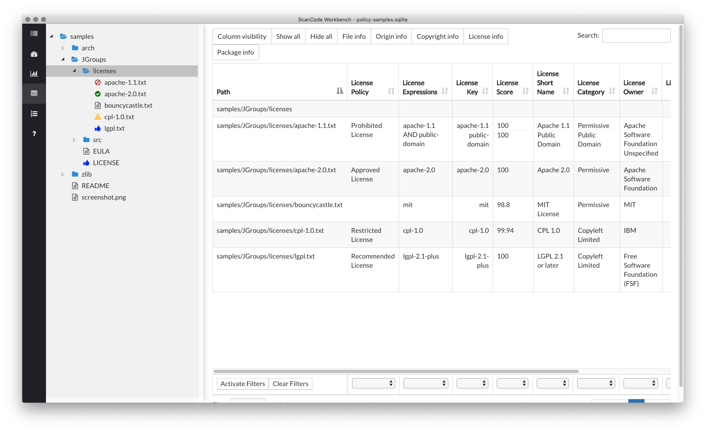

License Policy support in ScanCode Workbench
============================================

ScanCode Workbench now has basic support for tracking and viewing license policies that have been
applied to a ``scancode-toolkit`` scan. In order for things to work, your initial ``scancode`` scan
must be run with the ``--license-policy`` option. You can read more about that here:
:ref:`license_policy_plugin`.

The basics
----------

While the  :ref:`license_policy_plugin` can be customized with any number of custom fields and
values, ScanCode Workbench currently only supports a pre-defined set of policy labels.

.. list-table::
   :header-rows: 1

   * - license_key
     - label
   * - scancode_license_key
     - Approved License
   * - scancode_license_key
     - Prohibited License
   * - scancode_license_key
     - Recommended License
   * - scancode_license_key
     - Restricted License

This means in order to take advantage of ScanCode Workbench's policy features, your
``license-policy.yml`` needs to have ``license_key`` and ``label`` fields at the very least.

Additionally, in order to take advantage of policy visualizations, ``label`` values must be
one of the 4 above values: Approved License, Prohibited License, Recommended License or Restricted
License. Later versions of ScanCode Workbench will eventually evolve to support more dynamic policy
values.

Here is a simple example of a valid ``license-policy.yml`` file::

   license_policies:
   -   license_key: apache-2.0
       label: Approved License
   -   license_key: apache-1.1
       label: Prohibited License
   -   license_key: lgpl-2.1-plus
       label: Recommended License
   -   license_key: cpl-1.0
       label: Restricted License

After running a scan with that particular ``license-policy.yml`` file, viewing the scan in ScanCode
Workbench will look like the following:

As you can see, files which have detected licenses that fall under a particular policy will be
shown in the JSTree view with specific icons. This way, you are able to quickly see what files
fall under a specific policy.

Additionally, policy details can be found in the scan data view in their own column: License
Policy. This column has been added to both the "Origin" column set and "License info" column set.
